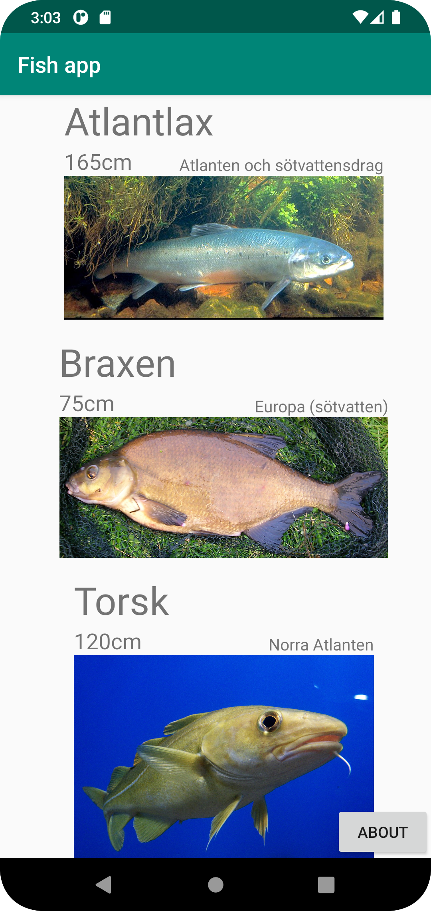
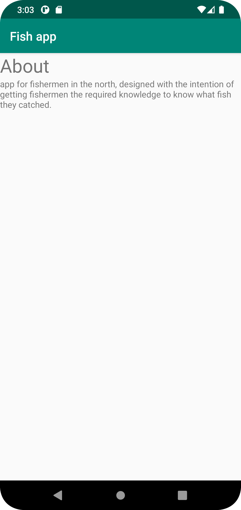

# Rapport projekt arbete
Till att börja med vill jag säga att jag inte gjorde någon skiss. Att ha gjort en skiss hade troligvis
hjälpt mig mycket med hur den slutgiltiga layouten skulle blivit. Däremot så blev jag nöjd med den
layouten som blev.

Jag började med att försöka tänka ut vad appen skulle handla om. Tillslut efter många om och men så
valde jag att appen skulle handla om fiskar.

Det första som gjordes i projektet var att skapa en recyclerview. Detta gjordes genom lägga till
```
    <androidx.recyclerview.widget.RecyclerView
        android:id="@+id/recyclerView"
        android:layout_width="match_parent"
        android:layout_height="0dp"
        app:layout_constraintBottom_toBottomOf="parent"
        app:layout_constraintEnd_toEndOf="parent"
        app:layout_constraintStart_toStartOf="parent"
        app:layout_constraintTop_toBottomOf="@+id/appBarLayout" />
```
i `activity_main.xml`. Sedan så skapades även recylerviewn i `MainActivity.java`. Det gjordes genom
att först skapa dessa 3 rader i toppen av MainActivity klassen.
```
    private RecyclerView recyclerView;
    private List<Fish> fish = new ArrayList<>();
    private FishAdapter fishAdapter;
```
Sedan skapades FishAdapter klassen. Detta gjordes genom mycket alt+enter och trycka sig vidare samt
att kolla exempelkod och passa in med sitt eget projekt. Efter detta skapades även klassen `Fish.java`
där getters och så vidare finns. När jag hade en färdig recyclerView så importerades även klassen
`JsonTask.Java` från dugga sidan. Efter lite strul så fanns det inga errors med den längre.
Detta lades i OnCreate.
```
        fishAdapter = new FishAdapter(fish);
        recyclerView=findViewById(R.id.recyclerView);
        recyclerView.setAdapter(fishAdapter);
        recyclerView.setLayoutManager(new LinearLayoutManager(getApplicationContext()));
```
och detta lades i OnPostExecute
```
 public void onPostExecute(String json) {
        Log.d("MainActivity", json);
        Gson gson = new Gson();
        Type type = new TypeToken<List<Fish>>() {}.getType();
        fish = gson.fromJson(json, type);
        fishAdapter.setFish(fish);
        fishAdapter.notifyDataSetChanged();
    }
```
Jag använde mig av Broms mountain json under testningen av recycler viewn.

Efter jag hade testat klart så skapades min egna json fil. Detta gjordes i Admin gränssnittet som fanns
tillhandahållet på dugga sidan. För att köra koden så lades detta till i MainActivity klassen.
```
    private final String JSON_URL = "https://mobprog.webug.se/json-api?login=g20karjo";
```
Ett problem jag hade var att jag använde attributet ID på fel sätt. Detta hade gått och lösa genom att
lägga datan från ID i någon av de andra attributen som fanns i admingrännsnittet sen ändrat i
`list_item.xml` , `Fish.java` och `FishAdapter.java` så att det matchar det nya attributet istället
för ID.

Sedan så pillades det lite med layouts i `list_item.xml`. Den slutgiltiga XML filen såg ut såhär.
``` 
<?xml version="1.0" encoding="utf-8"?>
<androidx.constraintlayout.widget.ConstraintLayout xmlns:android="http://schemas.android.com/apk/res/android"
    android:layout_width="match_parent"
    android:layout_height="wrap_content"
    android:layout_marginBottom="15dp"
    android:layout_marginStart="15dp"
    xmlns:app="http://schemas.android.com/apk/res-auto">

    <TextView
        android:id="@+id/fishName"
        android:layout_width="wrap_content"
        android:layout_height="wrap_content"
        android:textSize="35sp"
        app:layout_constraintStart_toStartOf="@id/fishImg"
        app:layout_constraintTop_toTopOf="parent"
        />

    <TextView
        android:id="@+id/fishSize"
        android:layout_width="wrap_content"
        android:layout_height="wrap_content"
        android:textSize="20sp"
        android:layout_marginBottom="10dp"
        app:layout_constraintTop_toBottomOf="@id/fishName"
        app:layout_constraintStart_toStartOf="@id/fishImg"/>

    <TextView
        android:id="@+id/fishID"
        android:textSize="15sp"
        android:layout_width="wrap_content"
        android:layout_height="wrap_content"
        app:layout_constraintEnd_toEndOf="@id/fishImg"
        app:layout_constraintBottom_toTopOf="@id/fishImg"/>

    <ImageView
        android:adjustViewBounds="true"
        android:maxHeight="200dp"
        android:maxWidth="300dp"
        android:id="@+id/fishImg"
        android:layout_width="wrap_content"
        android:layout_height="wrap_content"
        app:layout_constraintTop_toBottomOf="@id/fishSize"
        app:layout_constraintStart_toEndOf="parent"
        app:layout_constraintEnd_toEndOf="parent"
        app:layout_constraintStart_toStartOf="parent"
        />

</androidx.constraintlayout.widget.ConstraintLayout>
```
Det som sedan gjordes var att göra About sidan. Det gjordes genom att skapa en Button i `activity_main.xml`.
``` 
    <Button
        android:id="@+id/aboutButton"
        android:layout_width="wrap_content"
        android:layout_height="wrap_content"
        android:text="About"
        app:layout_constraintBottom_toBottomOf="parent"
        app:layout_constraintEnd_toEndOf="parent"/>
```
Sedan skapades knappen även i `MainActivity.java` under MainActivity klassen.
``` 
    private Button aboutButton;
```
sedan skapades även en onClickListener och ett intent i OnCreate för att knappen ska gå o klicka på.
``` 
        aboutButton = findViewById(R.id.aboutButton);
        aboutButton.setOnClickListener(new View.OnClickListener() {
            @Override
            public void onClick(View view) {
                Intent intent = new Intent(MainActivity.this, SecondActivity.class);
                startActivity(intent);
            }
        });
```
Det skapades även en ny aktivitet där about sidan skulle vara. I `activity_second.xml` så skapades 2
TextViews där den ena agera titel och den andra agera brödtext.
``` 
            <TextView
        android:id="@+id/title"
        android:layout_width="match_parent"
        android:layout_height="wrap_content"
        android:text="About"
        android:textSize="30sp"
        app:layout_constraintStart_toStartOf="parent"
        app:layout_constraintTop_toTopOf="parent"
        app:layout_constraintEnd_toEndOf="parent"
        />

    <TextView
        android:layout_width="match_parent"
        android:layout_height="wrap_content"
        android:text="app for fishermen in the north, designed with the intention of getting fishermen the required knowledge to know what fish they catched."
        app:layout_constraintStart_toStartOf="parent"
        app:layout_constraintTop_toBottomOf="@+id/title"
        app:layout_constraintEnd_toEndOf="parent"/>
```



Läs gärna:
